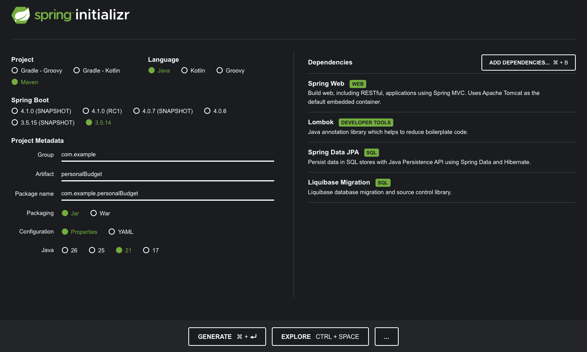
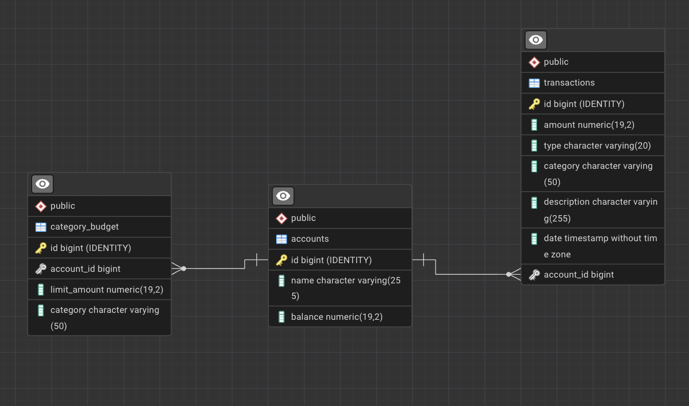

# Personal Budget

Aplikacja do zarządzania budżetem osobistym — REST API w Spring Boot wraz z prostym frontendem w React.
Pozwala prowadzić konta, rejestrować przychody i wydatki, ustawiać miesięczne limity wydatków
w poszczególnych kategoriach oraz analizować strukturę wydatków w wybranym okresie.

## Co aplikacja robi

**Konta** — każde konto ma nazwę i saldo. Saldo nie jest ustawiane ręcznie: wynika wyłącznie
z zarejestrowanych transakcji i jest aktualizowane przy każdej z nich. Nazwy kont są unikalne,
a konta posiadające transakcje nie mogą zostać usunięte (ochrona historii finansowej).

**Transakcje** — przychód (`INCOME`) lub wydatek (`EXPENSE`) w jednej z kategorii
(`HOUSING`, `FOOD`, `TRANSPORTATION`, `ENTERTAINMENT`, `SALARY`, `UNCATEGORIZED`).
Utworzenie transakcji i zmiana salda dzieją się w jednej transakcji bazodanowej,
z blokadą pesymistyczną na rekordzie konta (`findByIdForUpdate`) — dzięki temu równoległe
zapisy nie rozjeżdżają salda. Wydatek przekraczający dostępne środki jest odrzucany
(`InsufficientFundsException`). Usunięcie transakcji cofa jej wpływ na saldo.

**Limity kategorii** — dla pary konto + kategoria można ustawić miesięczny limit wydatków.
Limit nie blokuje transakcji, ale odpowiedź po zapisaniu wydatku zawiera flagę `budgetExceeded`
oraz sumę wydatków w danej kategorii w bieżącym miesiącu — decyzję o reakcji zostawiamy klientowi.

**Analityka** — dla konta i zakresu dat: suma przychodów, suma wydatków oraz rozbicie wydatków
na kategorie wraz z udziałem procentowym każdej z nich (zaokrąglenie `HALF_UP`).

## Stos technologiczny

| Warstwa | Technologia |
|---|---|
| Język / runtime | Java 21 |
| Framework | Spring Boot 3.5 (Web, Data JPA, Validation) |
| Baza danych | PostgreSQL 16 (docker) / H2 w trybie lokalnym |
| Migracje | Liquibase |
| Mapowanie DTO | MapStruct + Lombok |
| Dokumentacja API | springdoc-openapi (Swagger UI) |
| Frontend | React 18 + Vite + Tailwind, serwowany przez nginx |
| Testy | JUnit 5, Mockito, MockMvc |



## Model danych



Schemat tworzony jest wyłącznie migracjami Liquibase (`spring.jpa.hibernate.ddl-auto=none`),
pliki changelogów znajdują się w `src/main/resources/db/changelog/`.

## Architektura

Klasyczny podział warstwowy: `controller` → `service` → `repository`, z encjami JPA
odseparowanymi od API przez DTO.

- **Komendy i odpowiedzi to `record`** — `CreateTransactionCommand`, `AccountResponseDto` itd.
  Walidacja odbywa się deklaratywnie (`@Valid` + Bean Validation) na granicy kontrolera.
- **Logika domenowa siedzi w encji tam, gdzie to naturalne** — `Account.adjustBalance()`,
  `withdraw()` i `deposit()` pilnują niezmiennika salda zamiast rozsypywać ten warunek po serwisach.
- **Błędy jako hierarchia wyjątków** — wspólna baza `PersonalBudgetException`, tłumaczona
  na spójny `ErrorResponse` przez `@RestControllerAdvice` (`GlobalExceptionHandler`).
- **Zapytania agregujące w repozytorium** — sumy przychodów/wydatków i grupowanie po kategoriach
  liczone są po stronie bazy, nie w pamięci aplikacji.

```
src/main/java/com/example/personalBudget/
├── controller/   # Account, Transaction, CategoryBudget, Analytics
├── service/      # logika biznesowa
├── repository/   # Spring Data JPA + zapytania agregujące
├── model/        # encje JPA i enumy domenowe
├── dto/          # komendy wejściowe i odpowiedzi (records)
├── mapper/       # MapStruct
├── exception/    # wyjątki domenowe + globalny handler
└── config/       # konfiguracja CORS
```

## API

Bazowy adres: `http://localhost:8080/api/v1`

### Konta
| Metoda | Ścieżka | Opis |
|---|---|---|
| `GET` | `/accounts` | lista wszystkich kont |
| `POST` | `/accounts` | utworzenie konta (saldo startowe 0) |
| `GET` | `/accounts/{id}` | szczegóły konta |
| `DELETE` | `/accounts/{id}` | usunięcie konta bez transakcji |

### Transakcje
| Metoda | Ścieżka | Opis |
|---|---|---|
| `GET` | `/transactions` | lista stronicowana, filtry: `from`, `to`, `category` |
| `POST` | `/transactions` | zapis transakcji i aktualizacja salda |
| `DELETE` | `/transactions/{id}` | usunięcie transakcji z cofnięciem wpływu na saldo |

Filtrowanie i stronicowanie, np.:
`GET /api/v1/transactions?from=2026-06-01T00:00:00&to=2026-06-30T23:59:59&category=FOOD&page=0&size=20`

### Limity kategorii
| Metoda | Ścieżka | Opis |
|---|---|---|
| `POST` | `/budgets` | ustawienie limitu dla kategorii |
| `GET` | `/budgets/account/{accountId}` | limity danego konta |
| `PUT` | `/budgets` | zmiana limitu |
| `DELETE` | `/budgets/{id}` | usunięcie limitu |

### Analityka
| Metoda | Ścieżka | Opis |
|---|---|---|
| `GET` | `/accounts/{accountId}/analytics` | podsumowanie okresu i rozbicie wydatków na kategorie |

Pełna, interaktywna dokumentacja: **http://localhost:8080/swagger-ui/index.html**

## Uruchomienie

### Docker Compose (PostgreSQL, zalecane)

```bash
git clone https://github.com/BulandaK/personalBudget.git
cd personalBudget

./mvnw clean install        # windows: .\mvnw clean install
docker compose up --build
```

Po starcie dostępne są:

| Usługa | Adres |
|---|---|
| Frontend | http://localhost:80 |
| API | http://localhost:8080/api/v1 |
| Swagger UI | http://localhost:8080/swagger-ui/index.html |
| PostgreSQL | `localhost:5431` (`user` / `pass`) |
| pgAdmin | http://localhost:15432 |

Baza startuje z zestawem danych testowych, więc aplikacja jest gotowa do klikania od razu.

### Lokalnie na H2

Domyślna konfiguracja (`application.properties`) korzysta z pliku H2 w `./data/testdb` — wystarczy:

```bash
./mvnw spring-boot:run
```

Konsola H2: http://localhost:8080/h2-console

## Testy

```bash
./mvnw test
```

Testy jednostkowe (Mockito) pokrywają logikę serwisów — aktualizację salda, cofanie transakcji,
walidację reguł biznesowych. Testy integracyjne (MockMvc) sprawdzają kontrakt HTTP: kody odpowiedzi,
kształt JSON-a i obsługę błędów.

## Kolekcja zapytań

W katalogu [`bruno/`](bruno) znajduje się gotowa kolekcja dla klienta
[Bruno](https://www.usebruno.com/) z przykładowymi zapytaniami do wszystkich endpointów —
przydatna jako alternatywa dla Swaggera i frontendu.

## Uwagi

- [`AI_NOTES.md`](AI_NOTES.md) — zestawienie zagadnień, przy których korzystałem z narzędzi AI.
- Frontend jest prostym klientem testowym dla API, nie docelowym interfejsem produktu.
